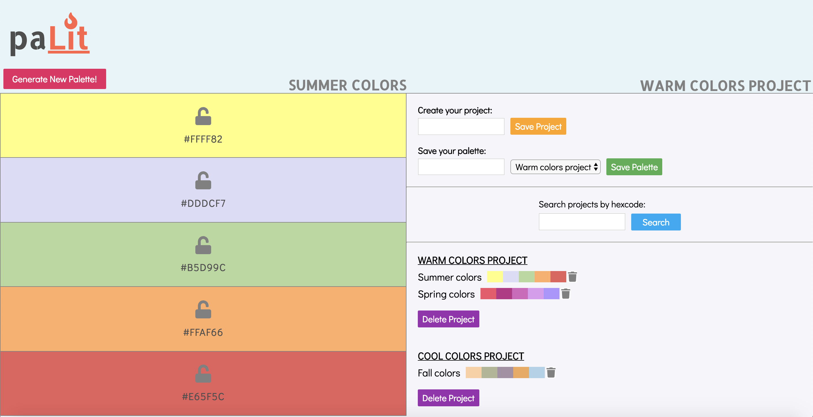

# Palette Picker
Palette Picker is a React app based on the website [Coolors](https://coolors.co/app), that helps users generate color palettes for websites and other design projects. 

### Set-Up Frontend:
- Clone this repo
- Run `npm install` from the root directory  
- Run `npm start` and visit localhost:3000 in your browser

### Backend API Repo:
- https://github.com/shannonmoranetz/palette-picker-api

### Backend API URL:
- https://palette-picker-api.herokuapp.com/

### Primary FE Technologies Used:
* React
* Redux
* JavaScript
* CSS/SCSS

### Primary BE Technologies Used:
* Express
* Knex
* PostgreSQL

### Testing:
Jest and Enzyme
Run `npm test` from the root directory  

### Final App (Desktop)

### Original Assignment: 
[Palette Picker](http://frontend.turing.io/projects/palette-picker.html)  

### Wireframes:
#### Desktop View:

### Design:
Inspiration from Dribble: cool color buttons with hover effect

### Future Enhancements:
- Media Queries
- Create functionality for searching projects by hexcode

This project was bootstrapped with [Create React App](https://github.com/facebook/create-react-app).
